# 多租戶 MySQL Zero-Downtime Migration 完整流程

## 總覽架構圖
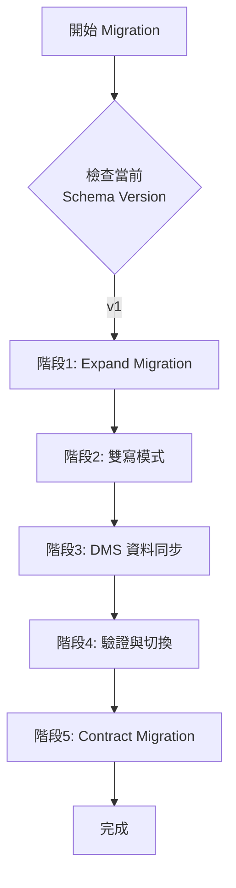

## 詳細五階段流程

### 階段 1: Expand Migration (v1 → v1.5)
**目標：擴充 Schema，保留舊欄位**
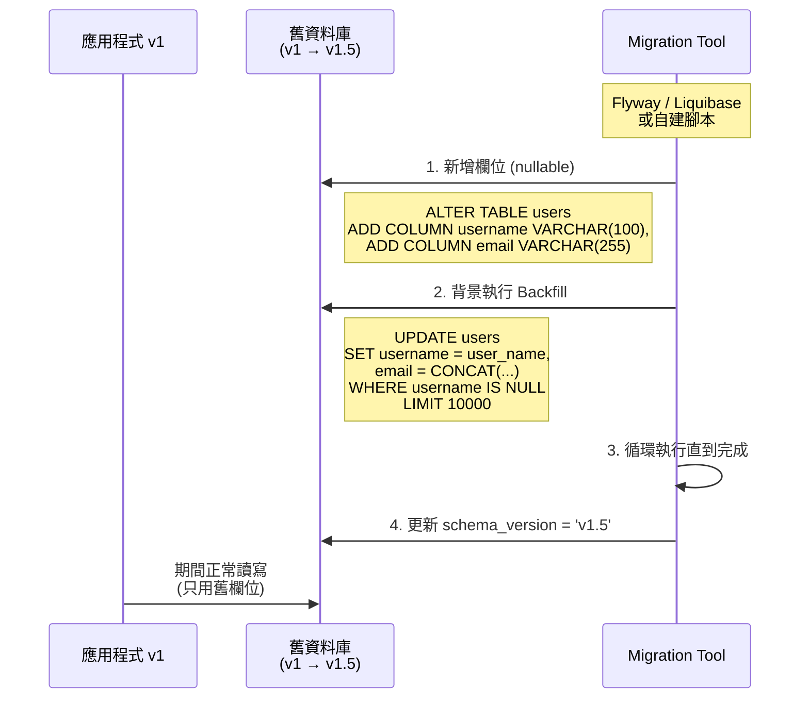

**使用服務/工具：**
- 🔧 **應用層**: Flyway、Liquibase、自建 Python/Node.js 腳本
- 🔧 **AWS**: 無 (純 SQL 操作)
- 🔧 **推薦工具**: pt-online-schema-change (大表)

---

### 階段 2: 雙寫模式
**目標：應用程式同時寫入新舊欄位**
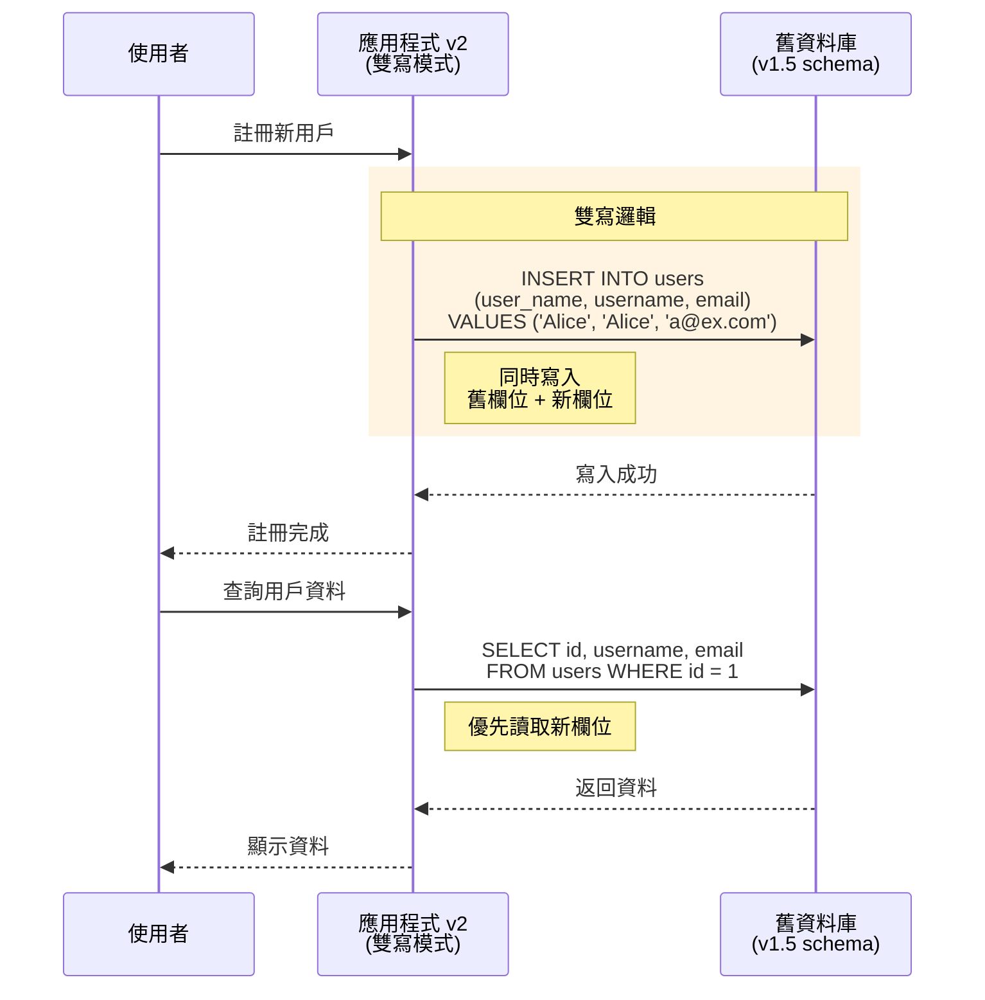

**使用服務/工具：**
- 🔧 **應用層**: 修改 ORM 層 (如 Sequelize, TypeORM, SQLAlchemy)
- 🔧 **AWS**: 無
- ⚠️ **注意事項**: 
  - 讀取時優先讀新欄位: `username ?? user_name`
  - 確保新舊欄位同步寫入

---

### 階段 3: DMS 資料同步 (Full Load + CDC)
**目標：複製資料到新資料庫並持續同步**
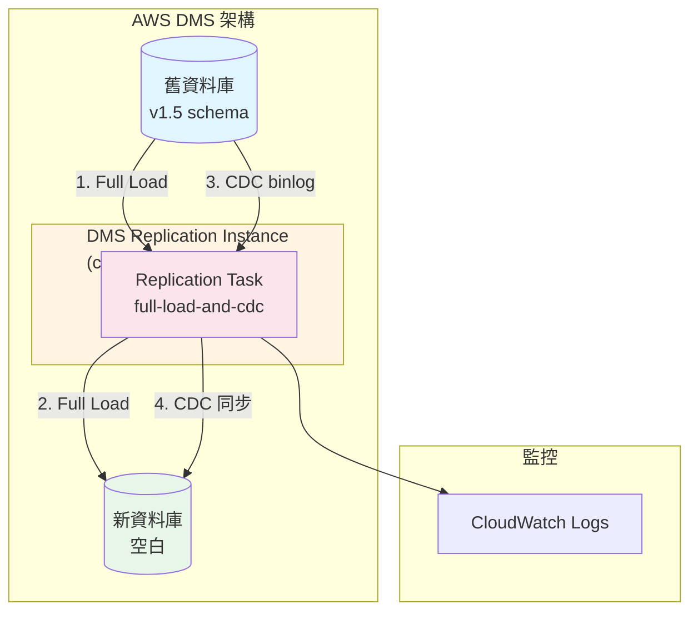

或者使用更簡潔的版本：
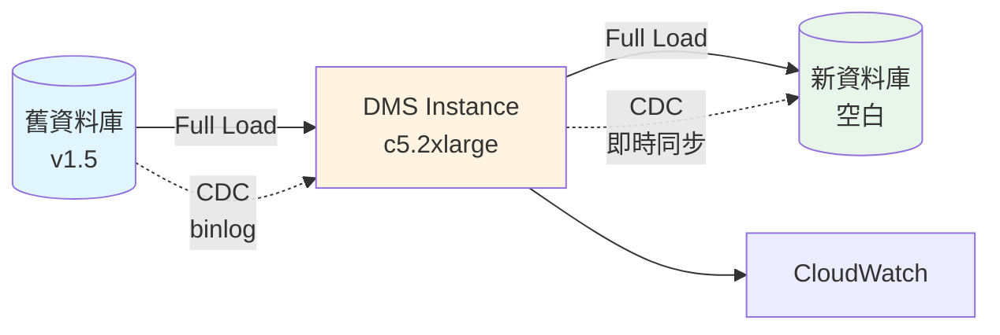

或者用序列圖方式呈現（最穩定）：
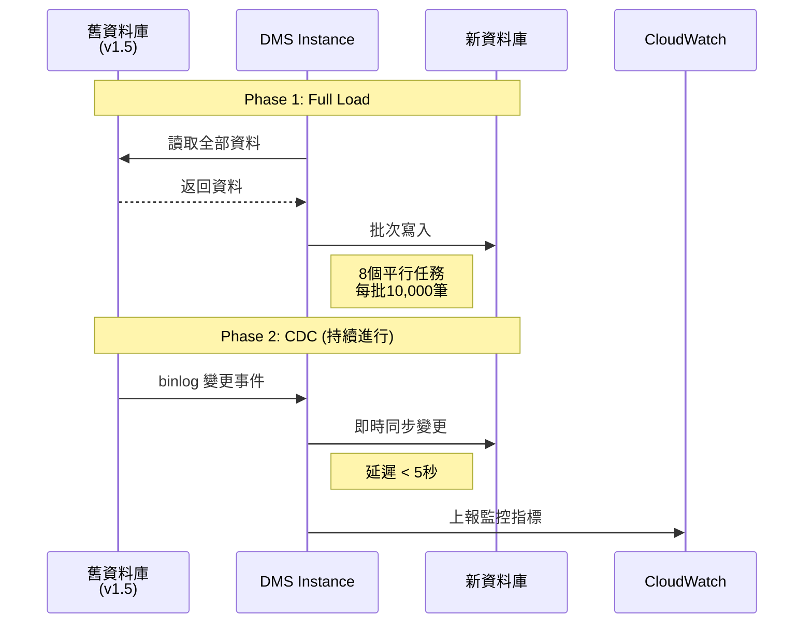

**推薦使用序列圖版本**，因為它最穩定且能清楚表達時序關係。

或者用更簡單的圖表：
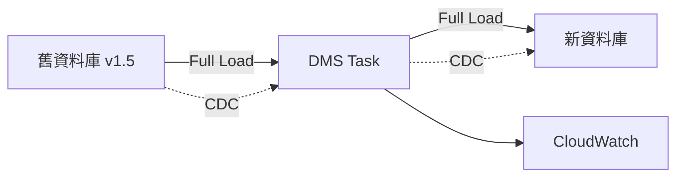

選擇最適合您的版本即可！建議使用序列圖，因為它最能清楚呈現 DMS 的運作流程。

**使用服務/工具：**
- ☁️ **AWS DMS**: Replication Instance, Endpoints, Tasks
- ☁️ **Amazon RDS**: 源和目標資料庫
- ☁️ **CloudWatch**: 監控 DMS 任務狀態、延遲
- ☁️ **SNS**: 發送告警通知

**關鍵配置：**
```json
{
  "MigrationType": "full-load-and-cdc",
  "FullLoadSettings": {
    "MaxFullLoadSubTasks": 8,
    "CommitRate": 10000
  },
  "ChangeProcessingTuning": {
    "BatchApplyEnabled": true,
    "MinTransactionSize": 1000
  }
}
```

---

### 階段 4: 驗證與切換
**目標：確認資料一致性後切換流量**
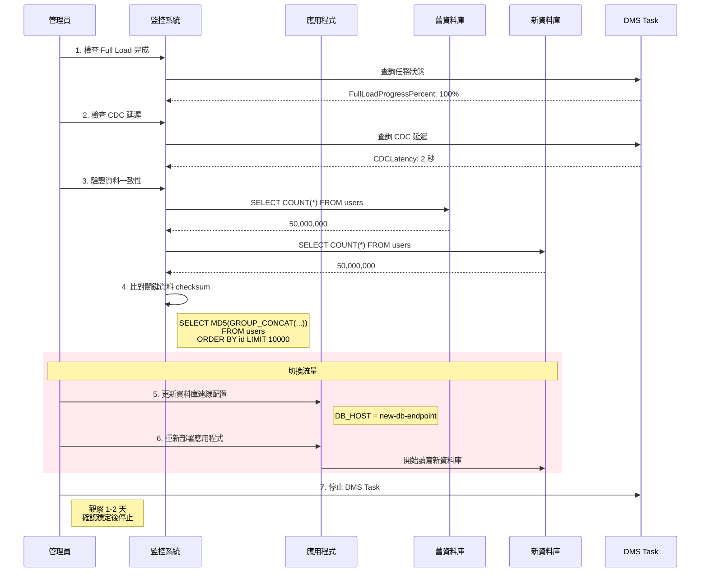

**使用服務/工具：**
- ☁️ **CloudWatch Dashboards**: 監控關鍵指標
- ☁️ **CloudWatch Alarms**: CDC 延遲、錯誤率告警
- 🔧 **應用層**: 資料一致性驗證腳本
- ☁️ **AWS Systems Manager**: 更新應用程式配置
- ☁️ **Elastic Load Balancer**: 流量切換 (如果使用)

---

### 階段 5: Contract Migration (v1.5 → v2)
**目標：清理舊欄位，完成 Schema 升級**
````mermaid
sequenceDiagram
    participant Admin as 管理員
    participant App as 應用程式 v3
    participant NewDB as 新資料庫<br/>(v1.5 到 v2)
    
    Note over Admin,NewDB: 等待 3-7 天確認穩定
    
    Admin->>NewDB: 1. 執行 Contract Migration
    Note right of NewDB: ALTER TABLE users<br/>DROP COLUMN user_name
    
    Admin->>NewDB: 2. 刪除其他舊欄位
    
    Admin->>NewDB: 3. 更新索引
    Note right of NewDB: 刪除舊索引<br/>建立新索引
    
    Admin->>NewDB: 4. 更新 schema_version
    Note right of NewDB: UPDATE schema_versions<br/>SET version = 'v2'
    
    Admin->>App: 5. 部署應用程式 v3
    Note right of App: 完全移除<br/>雙寫邏輯
    
    App->>NewDB: 只使用新欄位
    Note right of App: SELECT username, email<br/>FROM users
````

或者使用更簡單的流程圖版本：
````mermaid
graph TB
    Start[Contract Migration 開始] --> Step1[刪除舊欄位]
    Step1 --> Step2[更新索引]
    Step2 --> Step3[更新 schema_version]
    Step3 --> Step4[部署應用程式 v3]
    Step4 --> End[Migration 完成]
    
    Step1 -.->|SQL| SQL1[ALTER TABLE users<br/>DROP COLUMN user_name]
    Step2 -.->|SQL| SQL2[DROP INDEX idx_user_name<br/>CREATE INDEX idx_username]
    Step3 -.->|SQL| SQL3[UPDATE schema_versions<br/>SET version = v2]
````

**Contract Migration 步驟清單：**
````markdown
1. **刪除舊欄位**
```sql
   ALTER TABLE users DROP COLUMN user_name;
```

2. **更新索引**
```sql
   DROP INDEX idx_user_name ON users;
   CREATE INDEX idx_username ON users(username);
```

3. **更新 schema version**
```sql
   UPDATE schema_versions 
   SET version = 'v2', 
       updated_at = NOW();
```

4. **部署應用程式 v3**
   - 移除雙寫邏輯
   - 只使用新欄位 (username, email)

5. **驗證**
```sql
   -- 確認舊欄位已刪除
   SHOW COLUMNS FROM users;
   
   -- 確認應用程式正常運作
   SELECT username, email FROM users LIMIT 10;
```
````

推薦使用**流程圖版本**，因為它更清楚且不會有語法錯誤問題！

**使用服務/工具：**
- 🔧 **應用層**: Flyway、Liquibase
- 🔧 **AWS**: 無
- ⚠️ **注意事項**: 
  - 在非尖峰時段執行
  - 先備份再刪除
  - 保留回滾腳本

---

## 完整時間軸視圖
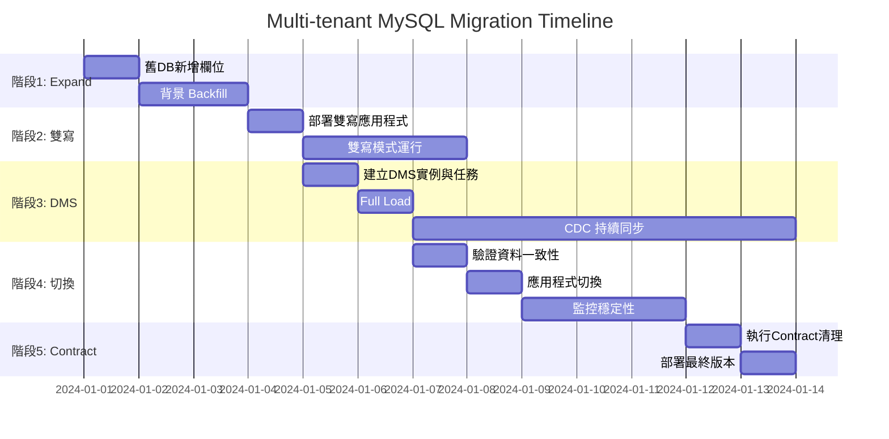

---

## Schema 版本演進圖
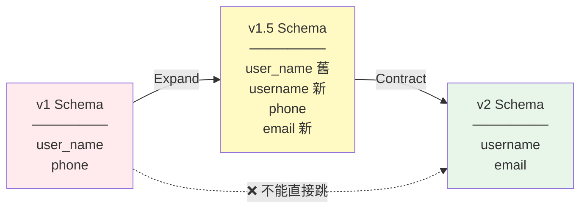

**欄位對照表：**
| v1 | v1.5 (過渡期) | v2 |
|---|---|---|
| user_name | user_name ✅<br/>username ✅ | username ✅ |
| phone | phone ✅ | phone ✅ |
| - | email ✅ | email ✅ |

---

## 多租戶批次部署策略
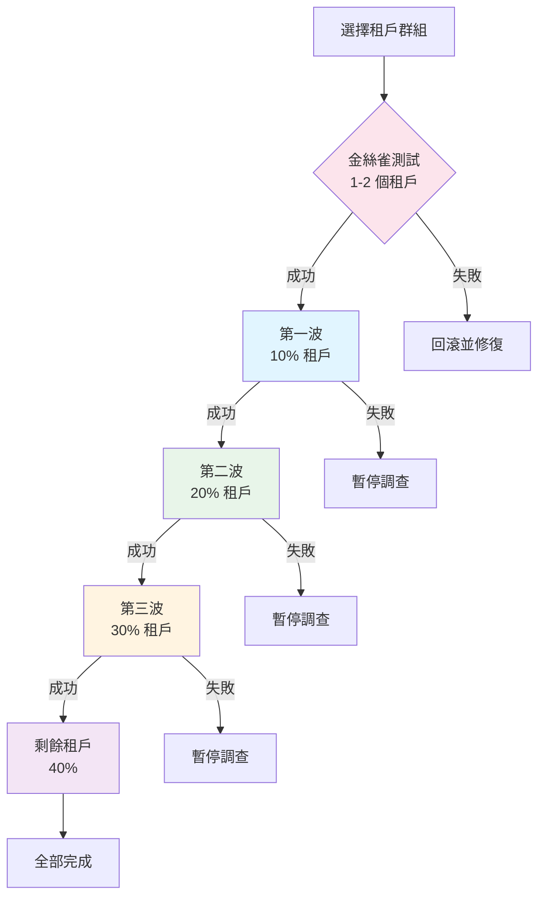

**批次策略：**
```python
租戶分組：
- 金絲雀 (1%): 內部測試租戶
- 第一波 (10%): 小型租戶 (< 100萬筆)
- 第二波 (20%): 中型租戶 (100萬-1000萬筆)
- 第三波 (30%): 大型租戶 (1000萬-5000萬筆)
- 最終波 (40%): 超大租戶 (> 5000萬筆)

每波間隔: 24-48 小時
```

---

## AWS 服務使用總覽
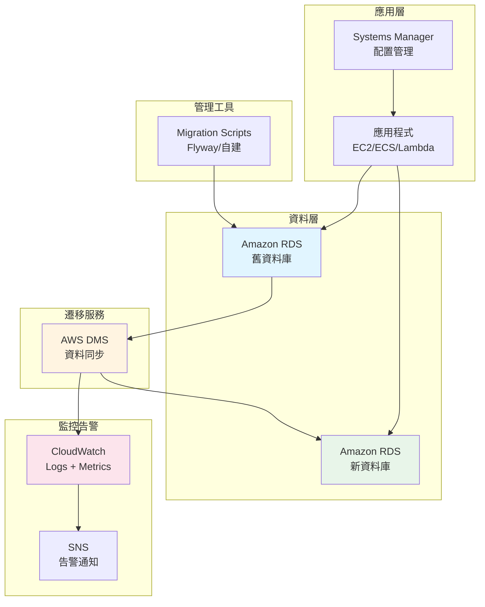

**服務責任分工：**

| 階段 | AWS 服務 | 應用層工具 |
|-----|---------|-----------|
| Expand Migration | - | Flyway, Liquibase, pt-osc |
| 雙寫模式 | - | ORM 修改, 應用程式邏輯 |
| 資料同步 | **DMS**, RDS, CloudWatch | - |
| 驗證切換 | CloudWatch, SNS, SSM | 自建驗證腳本 |
| Contract Migration | - | Flyway, Liquibase |

---

## 監控指標儀表板
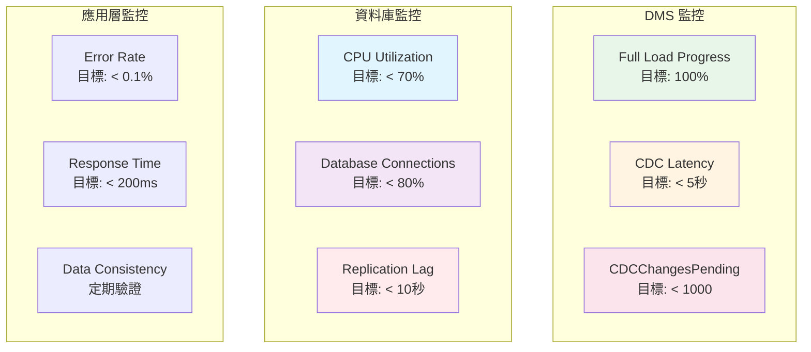

---

## 回滾計畫
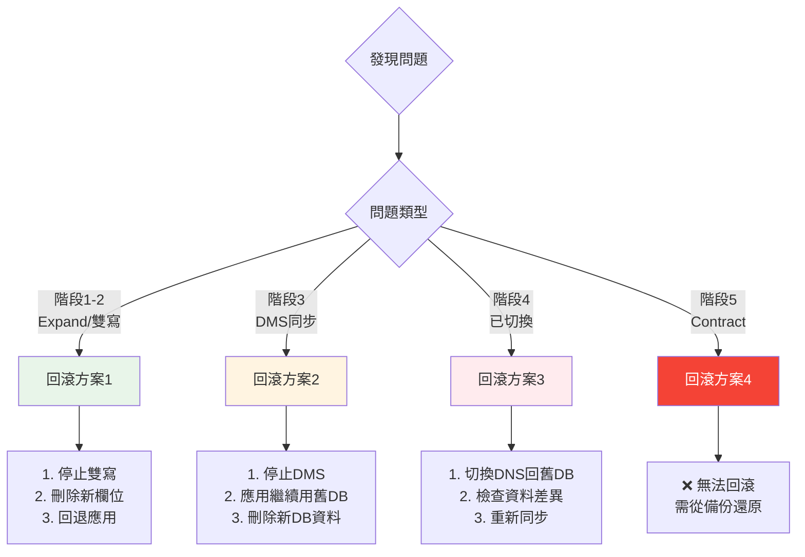

---

## 成本估算表

| 項目 | 規格 | 用量 | 單價 (USD) | 小計 |
|-----|------|------|-----------|------|
| DMS Instance | c5.2xlarge | 24 hrs | $0.492/hr | $11.81 |
| RDS Storage | 500 GB | 1 month | $0.115/GB/mo | $57.50 |
| Data Transfer | 跨AZ | 500 GB | $0.01/GB | $5.00 |
| CloudWatch Logs | 10 GB | 1 month | $0.50/GB | $5.00 |
| **單租戶總計** | - | - | - | **~$79** |
| **100租戶總計** | - | - | - | **~$7,900** |

*價格以 ap-northeast-1 為準，實際費用可能因地區而異*

---

## 常見問題 FAQ

### Q1: 為什麼不能先 Migration 新 DB 再用 CDC？
**A**: 因為 CDC 會嘗試將舊 schema 的變更套用到新 schema，欄位不匹配會導致同步失敗。

### Q2: DMS 能處理多大的資料量？
**A**: 理論上無限制，實測過 TB 級資料。關鍵是：
- 選擇適當的 Instance 規格
- 調整 BatchApply 參數
- 分批處理大型租戶

### Q3: 如果 Full Load 期間舊 DB 有寫入怎麼辦？
**A**: DMS 會：
1. 記錄 Full Load 開始時的 binlog 位置
2. Full Load 完成後，從該位置開始 CDC
3. 補上 Full Load 期間的變更

### Q4: 需要停機嗎？
**A**: 不需要！整個流程都是零停機：
- Expand: 在線上執行
- DMS: 背景同步
- 切換: 秒級 DNS/配置更新

### Q5: 多久可以完成？
**A**: 依資料量而定：
- 5000萬筆: 約 2-3 週
  - Expand: 2-3 天
  - DMS Full Load: 1-2 天
  - 驗證穩定: 1 週
  - Contract: 1 天