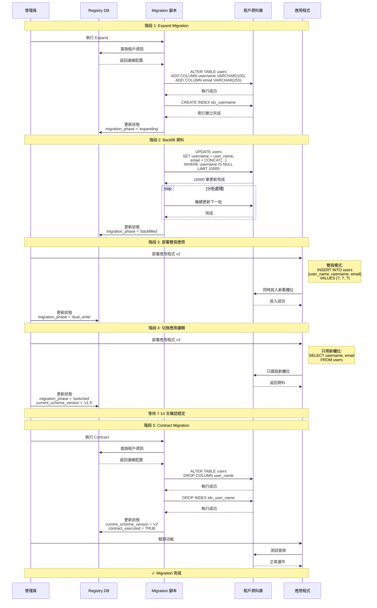
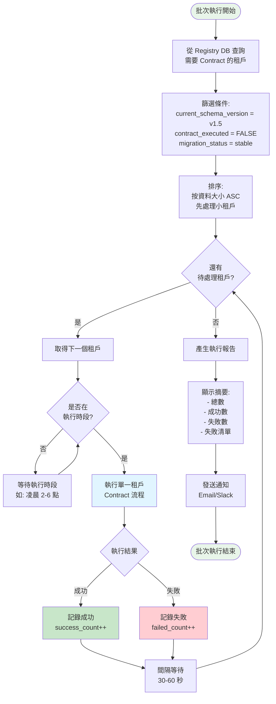

```mermaid
sequenceDiagram
    participant Admin as 管理員
    participant Registry as Registry DB
    participant Script as Migration 腳本
    participant DB as 租戶資料庫
    participant App as 應用程式
    
    Note over Admin,App: 階段 1: Expand Migration
    
    Admin->>Script: 執行 Expand
    Script->>Registry: 查詢租戶資訊
    Registry-->>Script: 返回連線配置
    
    Script->>DB: ALTER TABLE users<br/>ADD COLUMN username VARCHAR(100),<br/>ADD COLUMN email VARCHAR(255)
    DB-->>Script: 執行成功
    
    Script->>DB: CREATE INDEX idx_username
    DB-->>Script: 索引建立完成
    
    Script->>Registry: 更新狀態<br/>migration_phase = 'expanding'
    
    Note over Admin,App: 階段 2: Backfill 資料
    
    Script->>DB: UPDATE users<br/>SET username = user_name,<br/>email = CONCAT(...)<br/>WHERE username IS NULL<br/>LIMIT 10000
    DB-->>Script: 10000 筆更新完成
    
    loop 分批處理
        Script->>DB: 繼續更新下一批
        DB-->>Script: 完成
    end
    
    Script->>Registry: 更新狀態<br/>migration_phase = 'backfilled'
    
    Note over Admin,App: 階段 3: 部署雙寫應用
    
    Admin->>App: 部署應用程式 v2
    Note right of App: 雙寫模式:<br/>INSERT INTO users<br/>(user_name, username, email)<br/>VALUES (?, ?, ?)
    
    App->>DB: 同時寫入新舊欄位
    DB-->>App: 寫入成功
    
    Admin->>Registry: 更新狀態<br/>migration_phase = 'dual_write'
    
    Note over Admin,App: 階段 4: 切換應用邏輯
    
    Admin->>App: 部署應用程式 v3
    Note right of App: 只用新欄位:<br/>SELECT username, email<br/>FROM users
    
    App->>DB: 只讀寫新欄位
    DB-->>App: 返回資料
    
    Admin->>Registry: 更新狀態<br/>migration_phase = 'switched'<br/>current_schema_version = 'v1.5'
    
    Note over Admin,App: 等待 7-14 天確認穩定
    
    Note over Admin,App: 階段 5: Contract Migration
    
    Admin->>Script: 執行 Contract
    
    Script->>Registry: 查詢租戶資訊
    Registry-->>Script: 返回連線配置
    
    Script->>DB: ALTER TABLE users<br/>DROP COLUMN user_name
    DB-->>Script: 執行成功
    
    Script->>DB: DROP INDEX idx_user_name
    DB-->>Script: 執行成功
    
    Script->>Registry: 更新狀態<br/>current_schema_version = 'v2'<br/>contract_executed = TRUE
    
    Admin->>App: 驗證功能
    App->>DB: 測試查詢
    DB-->>App: 正常運作
    
    Note over Admin,App: ✅ Migration 完成
```

```mermaid
flowchart TD
    Start([批次執行開始]) --> QueryTenants[從 Registry DB 查詢<br/>需要 Contract 的租戶]
    
    QueryTenants --> Filter[篩選條件:<br/>current_schema_version = v1.5<br/>contract_executed = FALSE<br/>migration_status = stable]
    
    Filter --> Sort[排序:<br/>按資料大小 ASC<br/>先處理小租戶]
    
    Sort --> Loop{還有<br/>待處理租戶?}
    
    Loop -->|否| Report[產生執行報告]
    Loop -->|是| GetNext[取得下一個租戶]
    
    GetNext --> CheckTime{是否在<br/>執行時段?}
    
    CheckTime -->|否| WaitWindow[等待執行時段<br/>如: 凌晨 2-6 點]
    CheckTime -->|是| Execute[執行單一租戶<br/>Contract 流程]
    
    WaitWindow --> CheckTime
    
    Execute --> ExecuteResult{執行結果}
    
    ExecuteResult -->|成功| LogSuccess[記錄成功<br/>success_count++]
    ExecuteResult -->|失敗| LogFail[記錄失敗<br/>failed_count++]
    
    LogSuccess --> Interval[間隔等待<br/>30-60 秒]
    LogFail --> Interval
    
    Interval --> Loop
    
    Report --> Summary[顯示摘要:<br/>- 總數<br/>- 成功數<br/>- 失敗數<br/>- 失敗清單]
    
    Summary --> Notify[發送通知<br/>Email/Slack]
    
    Notify --> End([批次執行結束])
    
    style Start fill:#e8f5e9
    style Execute fill:#e1f5ff
    style LogSuccess fill:#c8e6c9
    style LogFail fill:#ffcdd2
    style End fill:#e8f5e9
```